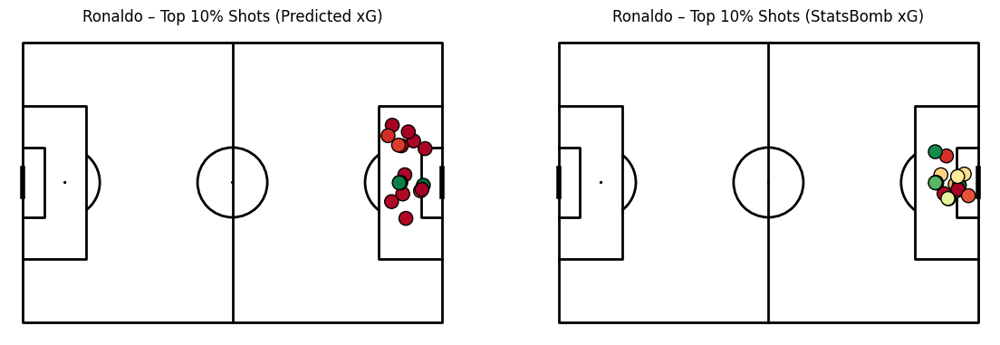

# Ronaldo_xG_project
An end-to-end Expected Goals (xG) model built with StatsBomb data, including feature engineering, model training, evaluation, and visualization. Features a case study analyzing Cristiano Ronaldo’s shots with comparison against official StatsBomb xG.
# Ronaldo xG Model ⚽

An end-to-end **Expected Goals (xG) model** using football event data (StatsBomb).  
The project builds a predictive model for shot success, evaluates it against official StatsBomb xG values, and visualizes insights with Cristiano Ronaldo’s shot data as a case study.  

---

## 🚀 Project Overview
- **Objective**: Predict the probability of a shot resulting in a goal (xG).  
- **Data**: StatsBomb open event data (shots, locations, body parts, etc.).  
- **Method**:
  - Feature engineering (distance, angle, shot characteristics).
  - Machine learning model for xG prediction.
  - Evaluation against StatsBomb xG with MAE.  
- **Case Study**: Cristiano Ronaldo’s shots, including visualization of his top 10% xG chances.  

---

## 📊 Results
- **Validation MAE**: ~0.066  
- **Ronaldo shots MAE vs StatsBomb xG**: ~0.069  
- Visual analysis shows that the custom model predicts reasonably well, but tends to slightly under-predict compared to StatsBomb (calibration opportunity).  

---

## 🎨 Visualizations
Two examples from the project:

### Top 10% Ronaldo shots by predicted xG vs StatsBomb xG
  
*(Left: model-predicted xG, Right: StatsBomb official xG)*
